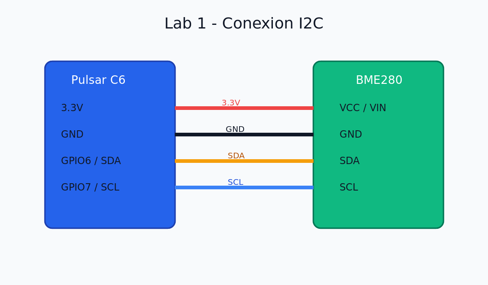

# Lab 1: Lectura de Sensores I²C

En esta práctica aprenderás a leer sensores digitales mediante el protocolo I²C.

## Objetivos

- Configurar el bus I²C en ESP32-C6
- Escanear dispositivos en el bus
- Leer datos del sensor BME280 (temperatura, presión, humedad)
- Mostrar datos en el monitor serial

## Materiales

- Placa Pulsar C6 (ESP32-C6)
- Sensor BME280 (I²C)
- Cables jumper
- Protoboard
- Resistencias pull-up 4.7kΩ (si el módulo no las incluye)

## Conexiones

```
ESP32-C6 Pulsar C6    BME280
━━━━━━━━━━━━━━━━━━━━━━━━━━━━
3.3V                  VCC (VIN)
GND                   GND
GPIO6 (SDA)           SDA
GPIO7 (SCL)           SCL
```



::: tip Resistencias Pull-up
La mayoría de los módulos BME280 ya incluyen resistencias pull-up integradas. Si tu módulo no las tiene, agrega resistencias de 4.7kΩ entre VCC y SDA, y entre VCC y SCL.
:::

## Código base

### Parte 1: Escaneo de dispositivos I²C

Primero, vamos a escanear el bus I²C para encontrar la dirección del BME280.

```c
#include <stdio.h>
#include "driver/i2c.h"
#include "esp_log.h"

#define I2C_MASTER_SCL_IO    7
#define I2C_MASTER_SDA_IO    6
#define I2C_MASTER_NUM       I2C_NUM_0
#define I2C_MASTER_FREQ_HZ   100000

static const char *TAG = "I2C_SCANNER";

void i2c_master_init(void)
{
    i2c_config_t conf = {
        .mode = I2C_MODE_MASTER,
        .sda_io_num = I2C_MASTER_SDA_IO,
        .scl_io_num = I2C_MASTER_SCL_IO,
        .sda_pullup_en = GPIO_PULLUP_ENABLE,
        .scl_pullup_en = GPIO_PULLUP_ENABLE,
        .master.clk_speed = I2C_MASTER_FREQ_HZ,
    };
    
    esp_err_t err = i2c_param_config(I2C_MASTER_NUM, &conf);
    if (err != ESP_OK) {
        ESP_LOGE(TAG, "Error configurando I2C: %s", esp_err_to_name(err));
        return;
    }
    
    err = i2c_driver_install(I2C_MASTER_NUM, conf.mode, 0, 0, 0);
    if (err != ESP_OK) {
        ESP_LOGE(TAG, "Error instalando driver I2C: %s", esp_err_to_name(err));
        return;
    }
    
    ESP_LOGI(TAG, "I2C inicializado correctamente");
}

void i2c_scanner(void)
{
    ESP_LOGI(TAG, "Escaneando bus I2C...");
    ESP_LOGI(TAG, "     0  1  2  3  4  5  6  7  8  9  a  b  c  d  e  f");
    
    for (uint8_t i = 0; i < 128; i += 16) {
        printf("%02x: ", i);
        
        for (uint8_t j = 0; j < 16; j++) {
            uint8_t addr = i + j;
            
            i2c_cmd_handle_t cmd = i2c_cmd_link_create();
            i2c_master_start(cmd);
            i2c_master_write_byte(cmd, (addr << 1) | I2C_MASTER_WRITE, true);
            i2c_master_stop(cmd);
            
            esp_err_t ret = i2c_master_cmd_begin(I2C_MASTER_NUM, cmd, pdMS_TO_TICKS(50));
            i2c_cmd_link_delete(cmd);
            
            if (ret == ESP_OK) {
                printf("%02x ", addr);
            } else {
                printf("-- ");
            }
        }
        printf("\n");
    }
    
    ESP_LOGI(TAG, "Escaneo completado");
}

void app_main(void)
{
    i2c_master_init();
    i2c_scanner();
}
```

### Parte 2: Lectura del BME280

```c
#include <stdio.h>
#include "driver/i2c.h"
#include "esp_log.h"
#include "freertos/FreeRTOS.h"
#include "freertos/task.h"

#define I2C_MASTER_SCL_IO    7
#define I2C_MASTER_SDA_IO    6
#define I2C_MASTER_NUM       I2C_NUM_0
#define I2C_MASTER_FREQ_HZ   400000

#define BME280_ADDR          0x76  // o 0x77 según el módulo
#define BME280_REG_CHIPID    0xD0
#define BME280_REG_CTRL_HUM  0xF2
#define BME280_REG_STATUS    0XF3
#define BME280_REG_CTRL_MEAS 0xF4
#define BME280_REG_CONFIG    0xF5
#define BME280_REG_DATA      0xF7

static const char *TAG = "BME280";

esp_err_t bme280_read_register(uint8_t reg_addr, uint8_t *data, size_t len)
{
    i2c_cmd_handle_t cmd = i2c_cmd_link_create();
    i2c_master_start(cmd);
    i2c_master_write_byte(cmd, (BME280_ADDR << 1) | I2C_MASTER_WRITE, true);
    i2c_master_write_byte(cmd, reg_addr, true);
    
    i2c_master_start(cmd);
    i2c_master_write_byte(cmd, (BME280_ADDR << 1) | I2C_MASTER_READ, true);
    
    if (len > 1) {
        i2c_master_read(cmd, data, len - 1, I2C_MASTER_ACK);
    }
    i2c_master_read_byte(cmd, data + len - 1, I2C_MASTER_NACK);
    i2c_master_stop(cmd);
    
    esp_err_t ret = i2c_master_cmd_begin(I2C_MASTER_NUM, cmd, pdMS_TO_TICKS(1000));
    i2c_cmd_link_delete(cmd);
    
    return ret;
}

esp_err_t bme280_write_register(uint8_t reg_addr, uint8_t data)
{
    i2c_cmd_handle_t cmd = i2c_cmd_link_create();
    i2c_master_start(cmd);
    i2c_master_write_byte(cmd, (BME280_ADDR << 1) | I2C_MASTER_WRITE, true);
    i2c_master_write_byte(cmd, reg_addr, true);
    i2c_master_write_byte(cmd, data, true);
    i2c_master_stop(cmd);
    
    esp_err_t ret = i2c_master_cmd_begin(I2C_MASTER_NUM, cmd, pdMS_TO_TICKS(1000));
    i2c_cmd_link_delete(cmd);
    
    return ret;
}

void bme280_init(void)
{
    // Leer Chip ID (debe ser 0x60)
    uint8_t chip_id;
    ESP_ERROR_CHECK(bme280_read_register(BME280_REG_CHIPID, &chip_id, 1));
    ESP_LOGI(TAG, "BME280 Chip ID: 0x%02X (esperado: 0x60)", chip_id);
    
    if (chip_id != 0x60) {
        ESP_LOGE(TAG, "Chip ID incorrecto. Verifica conexiones.");
        return;
    }
    
    // Configurar humedad (oversampling x1)
    bme280_write_register(BME280_REG_CTRL_HUM, 0x01);
    
    // Configurar temperatura y presión (oversampling x1, modo normal)
    bme280_write_register(BME280_REG_CTRL_MEAS, 0x27);
    
    // Configurar filtro y standby
    bme280_write_register(BME280_REG_CONFIG, 0xA0);
    
    vTaskDelay(pdMS_TO_TICKS(100));  // Esperar estabilización
    
    ESP_LOGI(TAG, "BME280 inicializado correctamente");
}

void bme280_read_data(float *temperature, float *pressure, float *humidity)
{
    uint8_t data[8];
    
    // Leer todos los datos (presión, temperatura, humedad)
    ESP_ERROR_CHECK(bme280_read_register(BME280_REG_DATA, data, 8));
    
    // Extraer valores crudos
    int32_t adc_P = (data[0] << 12) | (data[1] << 4) | (data[2] >> 4);
    int32_t adc_T = (data[3] << 12) | (data[4] << 4) | (data[5] >> 4);
    int32_t adc_H = (data[6] << 8) | data[7];
    
    // Conversión simplificada (sin compensación completa)
    // Para producción, usar las fórmulas de calibración del datasheet
    *temperature = (adc_T / 5123.0) - 50.0;
    *pressure = adc_P / 256.0;
    *humidity = adc_H / 1024.0;
}

void app_main(void)
{
    // Inicializar I2C
    i2c_config_t conf = {
        .mode = I2C_MODE_MASTER,
        .sda_io_num = I2C_MASTER_SDA_IO,
        .scl_io_num = I2C_MASTER_SCL_IO,
        .sda_pullup_en = GPIO_PULLUP_ENABLE,
        .scl_pullup_en = GPIO_PULLUP_ENABLE,
        .master.clk_speed = I2C_MASTER_FREQ_HZ,
    };
    i2c_param_config(I2C_MASTER_NUM, &conf);
    i2c_driver_install(I2C_MASTER_NUM, conf.mode, 0, 0, 0);
    
    // Inicializar BME280
    bme280_init();
    
    // Loop de lectura
    while (1) {
        float temperature, pressure, humidity;
        bme280_read_data(&temperature, &pressure, &humidity);
        
        ESP_LOGI(TAG, "Temperatura: %.2f °C", temperature);
        ESP_LOGI(TAG, "Presión: %.2f hPa", pressure);
        ESP_LOGI(TAG, "Humedad: %.2f %%", humidity);
        ESP_LOGI(TAG, "---");
        
        vTaskDelay(pdMS_TO_TICKS(2000));
    }
}
```

## Ejercicios

### Ejercicio 1: Calibración
Implementa la calibración completa del BME280 usando los coeficientes de compensación almacenados en los registros 0x88-0xA1 y 0xE1-0xE7. Consulta el [datasheet del BME280](https://www.bosch-sensortec.com/media/boschsensortec/downloads/datasheets/bst-bme280-ds002.pdf).

### Ejercicio 2: Múltiples sensores
Conecta dos sensores I²C diferentes (por ejemplo, BME280 y BH1750) y lee datos de ambos.

### Ejercicio 3: Promediado
Implementa un filtro de promediado móvil de 10 muestras para suavizar las lecturas.

## Solución de problemas

| Problema | Solución |
|----------|----------|
| No se detecta el sensor | Verificar conexiones, dirección (0x76 vs 0x77), alimentación |
| Chip ID incorrecto | Verificar que es un BME280 genuino, no BMP280 |
| Lecturas erráticas | Agregar delay después de la inicialización, verificar pull-ups |
| ACK error | Verificar resistencias pull-up, reducir velocidad I²C |

## Próximos pasos

- [Lab 2: Pantalla OLED](./lab02-oled-display.md) - Visualizar los datos en pantalla
- [Guía I²C](../guide/i2c.md) - Profundizar en el protocolo
- [Sensores y transductores](../guide/sensors.md) - Más sobre sensores

## Referencias

- [BME280 Datasheet](https://www.bosch-sensortec.com/media/boschsensortec/downloads/datasheets/bst-bme280-ds002.pdf)
- [ESP32-C6 I²C Driver](https://docs.espressif.com/projects/esp-idf/en/latest/esp32c6/api-reference/peripherals/i2c.html)
- [Bosch BME280 Driver](https://github.com/boschsensortec/BME280_SensorAPI)
