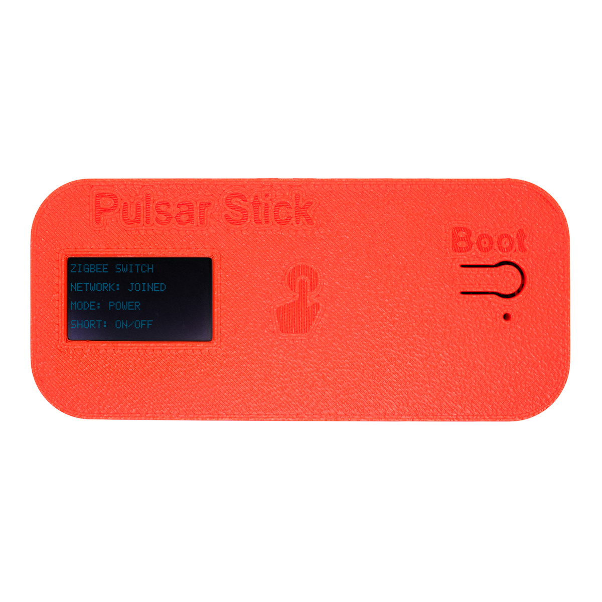
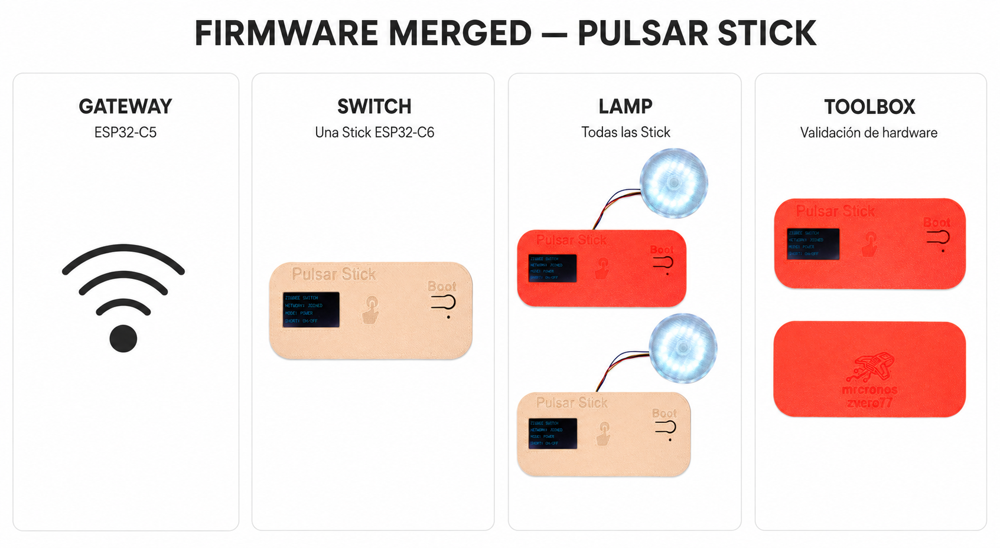
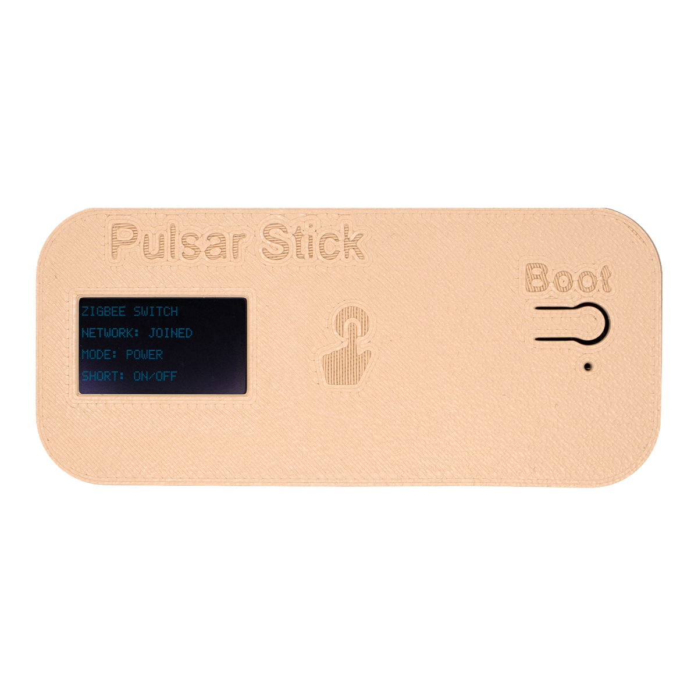
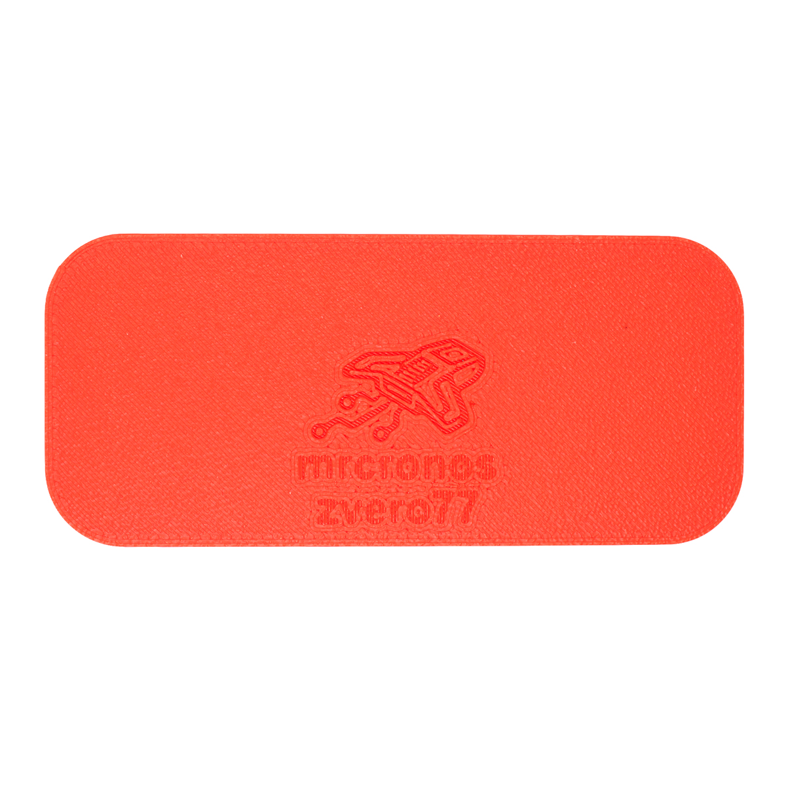
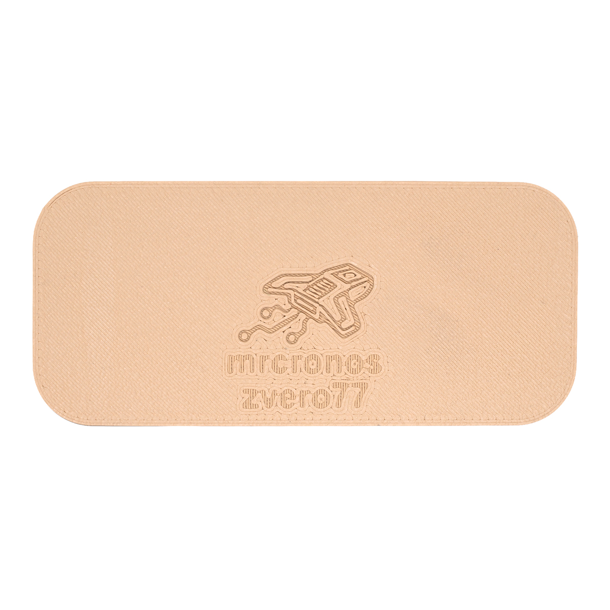
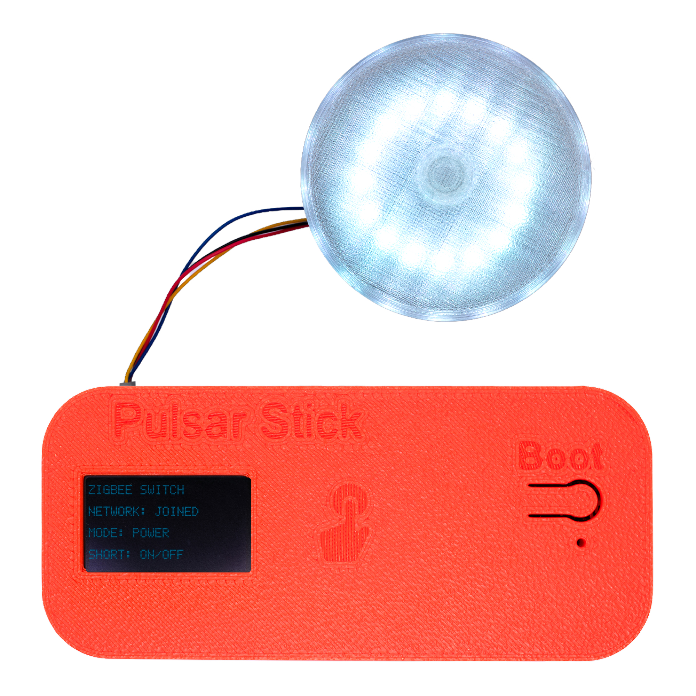
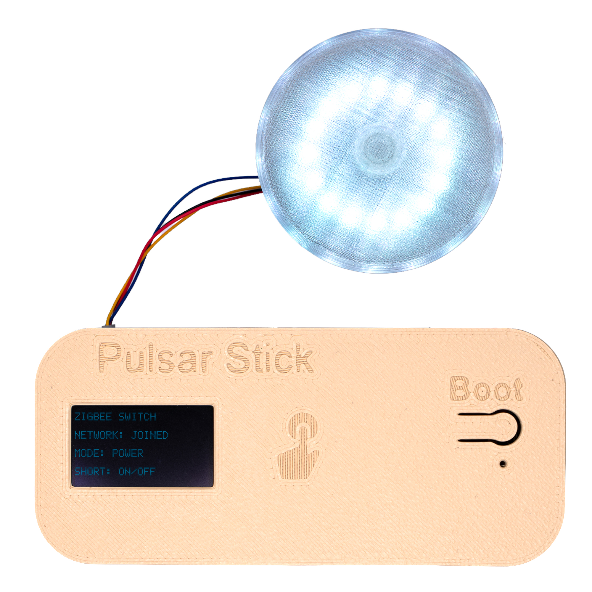

# Lab 7: PULSAR Stick — Red Zigbee

La **PULSAR Stick** es un desarrollo pensado para facilitar la experiencia
con microcontroladores a la hora de realizar conexiones. Integra un
conector de salida rápida **Qwiic I²C** para implementar sensores, lo que
facilita la comprensión de los conceptos.

El formato "stick" es un formato de desarrollo pensado como banco de
pruebas I²C, con un botón I²C que agiliza el desarrollo. Consta de un
sistema principal **PULSAR C6**, elaborado con una conexión I²C a un
display OLED y una salida Qwiic (`SDA` en el pin 6, `SCL` en el pin 7),
con el fin de facilitar la comprensión de los conceptos. Además, se
considera **Zigbee** como una experiencia compartida para este producto.

### Pantalla OLED de estado

El display OLED integrado reporta en todo momento el estado del
dispositivo, sin depender de un depurador ni del monitor serial:

- `ZIGBEE SWITCH` — rol/función activa del firmware cargado.
- `NETWORK: JOINED` — estado de la unión a la red Zigbee.
- `MODE: POWER` — modo de operación configurado.
- `SHORT: ON/OFF` — acción asignada a la pulsación corta del botón.

Esta lectura en pantalla permite comprobar el rol cargado y el estado de
la red sin depender de un depurador ni del monitor serial.

## Objetivo del taller

Configurar una red Zigbee con dispositivos PULSAR, asignar los firmware
merged de Gateway, Switch y Lamp, y validar el control de las lámparas
desde una PULSAR Stick configurada como interruptor.

## Resultados del aprendizaje

Al finalizar, los participantes podrán:

- Identificar las funciones de Gateway, Switch y Lamp dentro de la red
  Zigbee de la práctica.
- Seleccionar el binario merged correcto para un Gateway ESP32-C5 y para
  cada PULSAR Stick ESP32-C6.
- Cargar los firmware mediante Panel Loader y comprobar el rol activo en
  la pantalla OLED.
- Incorporar las PULSAR Stick a la red y verificar el estado
  `NETWORK: JOINED`.
- Generar comandos desde una única Stick configurada como Switch y
  observar la respuesta de las Stick configuradas como Lamp.
- Reconocer las funciones de coordinador, enrutador y dispositivo final
  dentro de una red Zigbee.
- Usar el firmware Toolbox como herramienta de diagnóstico cuando sea
  necesario validar el hardware.
- Registrar evidencia del rol, la unión a la red y la respuesta de las
  lámparas durante la prueba final.

## Metodología

| Etapa | Asignación de roles | Dinámica |
|---|---|---|
| **Etapa 1: Preparación** | 1 Gateway · 1 Switch · las demás PULSAR Stick como Lamp | Cada integrante descarga y carga el binario merged correspondiente a su placa mediante Panel Loader. |
| **Etapa 2: Integración Zigbee** | Roles fijos durante la prueba | El equipo inicia el Gateway, incorpora las PULSAR Stick a la red y comprueba `NETWORK: JOINED` en cada pantalla. |
| **Etapa 3: Validación** | Switch y Lamp | Se generan comandos desde la única Stick Switch y se verifica la respuesta de todas las Stick Lamp. Toolbox se utiliza solo si es necesario diagnosticar hardware. |

## Materiales para el taller

| Producto | Cantidad | Función |
|---|---|---|
| Gateway ESP32-C5 | 1 por red | Crear y administrar la red Zigbee |
| PULSAR Stick ESP32-C6 | 1 como Switch | Enviar los comandos de control |
| PULSAR Stick ESP32-C6 | Las demás como Lamp | Recibir los comandos y controlar las lámparas |
| Módulo de lámpara Qwiic | 1 por Stick Lamp | Mostrar la respuesta al comando Zigbee |
| Cable USB de datos | 1 por placa durante la carga | Programación mediante Panel Loader |

## Carga de firmware — Panel Loader

Los dispositivos de la práctica se programan desde el navegador con
**Panel Loader**, sin instalar `esptool` ni drivers adicionales. Elige
el firmware que corresponda al microcontrolador y a la función de cada
placa:

**[Abrir Panel Loader](https://unit-electronics-labs.github.io/unit_microsupport_labs/)**

> Requiere un navegador con soporte WebSerial/WebUSB (Chrome o Edge de
> escritorio). Firefox y Safari no son compatibles.

### Descarga de firmware merged

Estos binarios ya contienen las imágenes necesarias en un solo archivo
y están listos para seleccionarse desde Panel Loader:

| Firmware | Aplicación | Archivo de descarga |
|---|---|---|
| Gateway | Para ESP32-C5 | [Descargar `pulsar_stick_gateway_merged.bin`](/examples/firmware/pulsar_stick_gateway_merged.bin) |
| Switch | Para una sola Stick con ESP32-C6 | [Descargar `pulsar_stick_switch_merged.bin`](/examples/firmware/pulsar_stick_switch_merged.bin) |
| Lamp | Para todas las PULSAR Stick | [Descargar `pulsar_stick_lamp_merged.bin`](/examples/firmware/pulsar_stick_lamp_merged.bin) |
| Toolbox | Herramienta de pruebas para validación de hardware | [Descargar `pulsar_stick_TOOLBOX_merged.bin`](/examples/firmware/pulsar_stick_TOOLBOX_merged.bin) |

### Protocolo de carga

| Pestaña del panel | Protocolo | Placa de esta práctica |
|---|---|---|
| **ESP32** | Serie / esptool-js | **Gateway ESP32-C5** y PULSAR Stick **ESP32-C6** con firmware Switch, Lamp o Toolbox |

### Pasos para cargar un firmware

1. Abre el enlace del Panel Loader y selecciona la pestaña **ESP32**.
2. En **Firmware**, da clic en **Seleccionar firmware** y elige el
   archivo `.bin` merged correspondiente:
   - **Archivo local**: el binario recién compilado en tu equipo.
   - **Catálogo web**: una versión ya publicada, si el instructor la
     agregó al catálogo del repositorio.
3. Revisa la **dirección de flash** (`0x0000` por defecto) y la
   **velocidad de carga** (115200 baud es un valor seguro para
   empezar).
4. Da clic en **Conectar ESP** y selecciona el puerto que te ofrezca el
   navegador.
5. Da clic en **Programar firmware** y espera a que el progreso llegue
   a 100%.
6. Repite el proceso con las demás placas según la función asignada a
   cada una.

### Programación por estaciones (varios equipos en paralelo)

En modo **ESP32** el panel ofrece una grilla de hasta **10 estaciones**
para conectar y programar varias PULSAR ESP32-C6 a la vez desde una
sola computadora — útil en la Etapa 1 del taller, cuando varias parejas
programan su placa al mismo tiempo:

1. Da clic en **Conectar ESP** dentro de cada estación para asignarle
   un dispositivo.
2. Usa **Seleccionar conectados** para marcar todas las estaciones con
   placa detectada.
3. Da clic en **Programar seleccionados** para cargar el mismo
   firmware en todas las estaciones marcadas en un solo paso.

El resumen inferior (**OK · SIN FLASH · ERROR**) indica cuántas
estaciones terminaron correctamente, y la consola **esptool / ESP** en
la parte inferior del panel muestra el log en tiempo real — revísala si
una carga falla o un dispositivo no queda en **OK**.

## Vista del producto

La carcasa de la PULSAR Stick está impresa en 3D y disponible en dos
acabados de color; el hardware y las conexiones son idénticos en ambos
casos.

| | Variante roja | Variante beige |
|---|---|---|
| **Frente** — display OLED y botón BOOT |  |  |
| **Reverso** — grabado de marca |  |  |
| **Con módulo LED Qwiic** conectado |  |  |

La salida Qwiic (`SDA` pin 6, `SCL` pin 7) permite conectar módulos como
el anillo de LEDs mostrado arriba para validar rápidamente el bus I²C
antes de integrar los sensores propios del taller.
