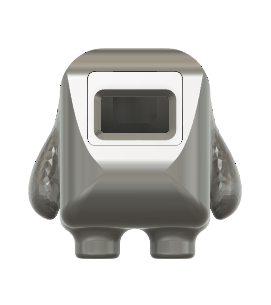
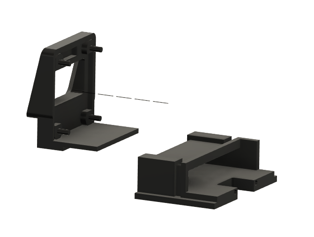
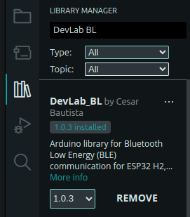
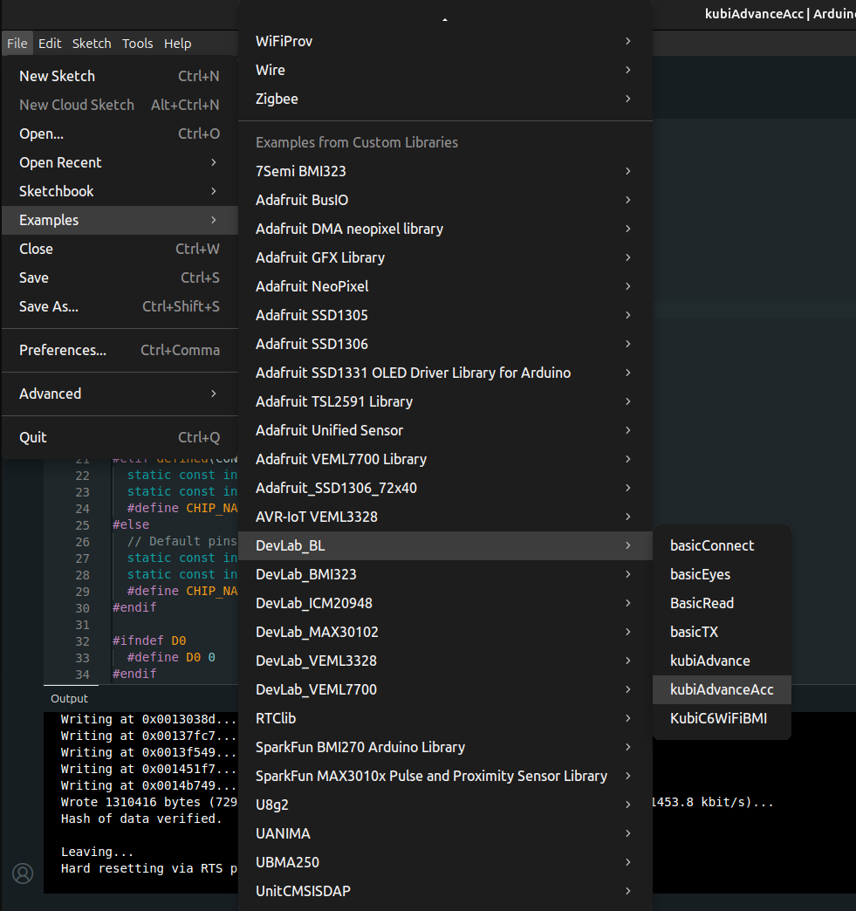
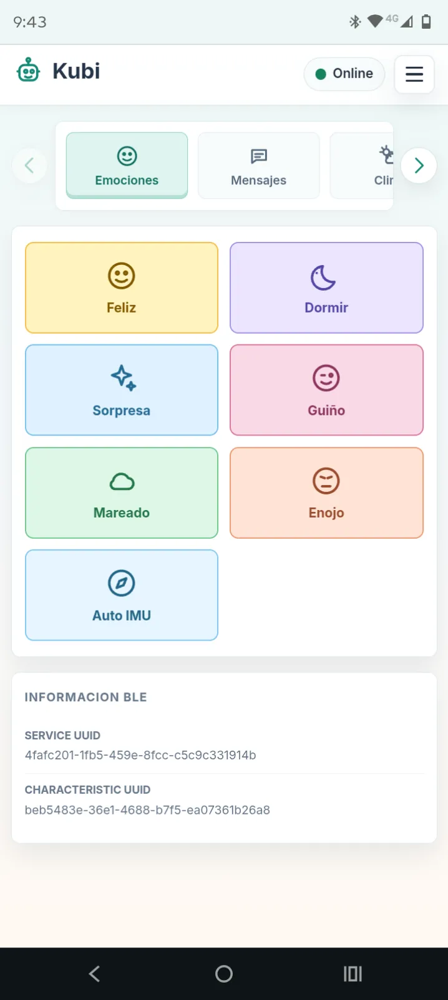
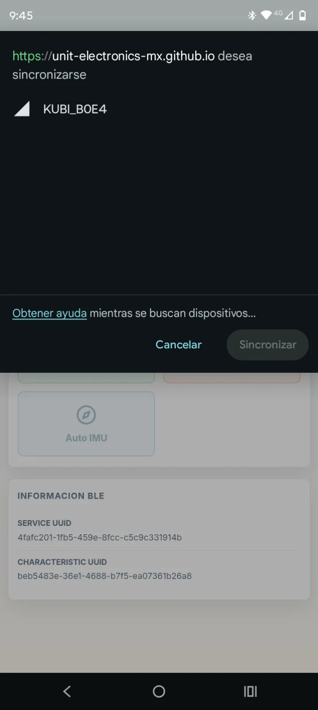
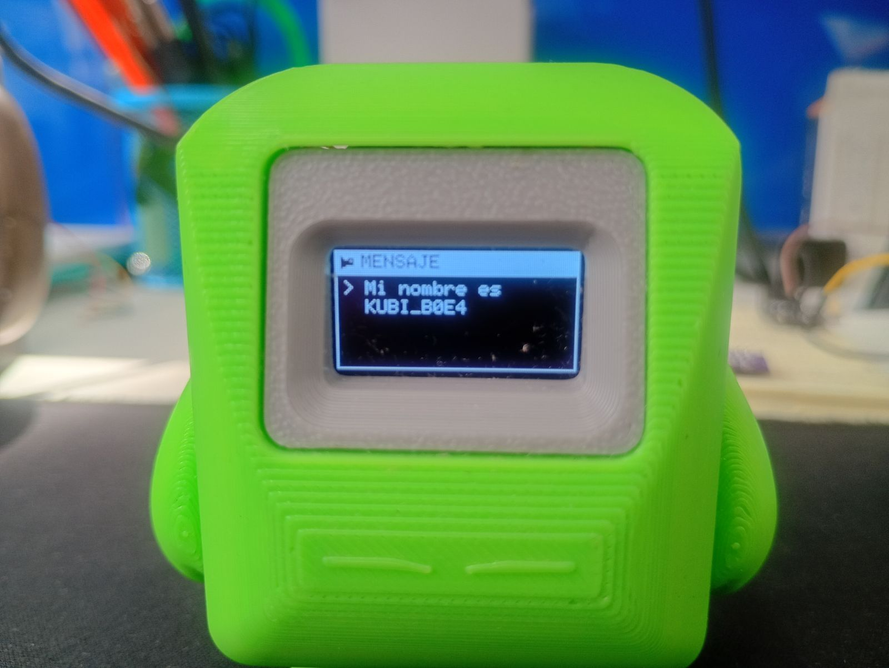
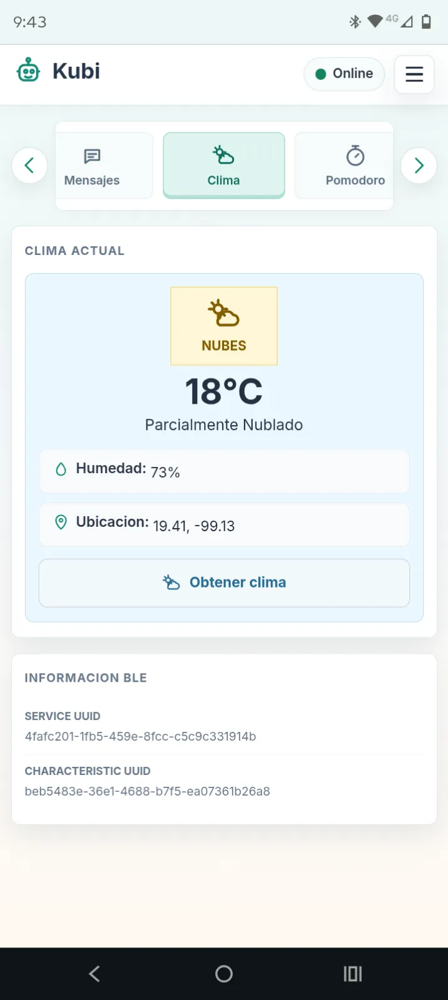
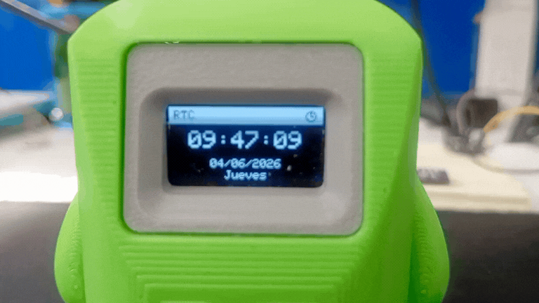

# Kubi

Kubi es una plataforma modular de mascota de escritorio diseñada para crear un compañero de escritorio interactivo y expresivo utilizando sistemas embebidos, sensores, comunicación inalámbrica y retroalimentación visual animada.

Construido alrededor del ecosistema DevLab y la serie Pulsar ESP32, Kubi combina detección de movimiento, emociones basadas en pantalla OLED, expansión modular y conectividad inalámbrica en una plataforma de desarrollo personalizable, adecuada para makers, estudiantes, educadores y desarrolladores embebidos.

Kubi puede mostrar emociones, reaccionar al movimiento, entrar en modos de animación inactiva, visualizar el estado del sistema y servir como plataforma para experimentar con sensores, IoT y aplicaciones de inteligencia artificial embebida.

## Características

- Expresiones emocionales animadas en pantalla OLED
- Detección de movimiento y orientación usando el BMI270
- Conectividad modular con el ecosistema QWIIC/DevLab
- Soporte de comunicación inalámbrica vía ESP32-C6/H2
- Operación portátil alimentada por batería
- Arquitectura de sensores expandible
- Estados interactivos de inactividad y reacción
- Diseñado para experimentación y educación

## Arquitectura del sistema

Kubi está basado en una arquitectura modular que permite conectar múltiples periféricos y sensores a través de interfaces estandarizadas QWIIC.

Los principales subsistemas incluyen:

| Módulo | Función |
| --- | --- |
| Pulsar ESP32-C6/H2 | Procesamiento principal y conectividad | 
| OLED SSD1306 | Expresiones faciales y visualización de estado | 
| IMU BMI270 | Detección de movimiento y orientación | 
| Sistema de batería LiPo | Alimentación portátil | 
| Hub de expansión QWIIC | Conectividad modular de sensores |
| Módulos del ecosistema DevLab | Soporte para expansión futura | 

**Rotación 3D de Kubi**

<p align="center">
  
</p>

Vista de rotación 3D del Kubi Desk Pet.

Kubi usa la libreria de Arduino DevLab_BL. Esta libreria provee el firmware base necesario para el funcionamiento de las caracteristicas de Kubi, usando la ESP32 Pulsar H2.

## Ensamble

Antes de cargar el firmware, arma la carcasa y los componentes mecánicos de Kubi siguiendo la animación de ensamble:

<p align="center">
  
</p>

Los archivos mecánicos (piezas para impresión 3D/corte y demás recursos de ensamble) están disponibles para descarga directa:

[Descargar archivos mecánicos (mechanics.zip)](/kubi/mechanics.zip)

## Instalación

Kubi usa la librería Devlab_BL. Esta librería provee las funciones base del firmware utilizadas por la versión Pulsar H2 de Kubi:

- Control de la pantalla OLED
- Acceso al sensor de movimiento BMI270
- Renderizado de emociones y animaciones
- Reacciones basadas en movimiento
- Modos de comportamiento automático
- Manejo de comandos vía Web Bluetooth
- Funciones de interacción con el usuario

### Instalar la librería

Abre el Arduino IDE y ve a:

`Sketch → Include Library → Manage Libraries`

Busca:

`Devlab_BL`

Haz clic en **Install** para agregar la librería a tu entorno de Arduino.

<p align="center">
  
</p>

:::info
Tambien puedes acceder al repositorio de github de la libreria [unit_devlab_bl_library](https://github.com/UNIT-Electronics-MX/unit_devlab_bl_library)
:::

### Abrir el ejemplo

Una vez instalada la librería, sigue estos pasos para abrir el ejemplo de Kubi en el Arduino IDE:

1. Ve al menú **File → Examples**.
2. En la sección **Examples from Custom Libraries**, busca y selecciona **DevLab_BL**.
3. En el submenú, selecciona el ejemplo **kubiAdvanceAcc**.
4. El sketch se abrirá en una nueva ventana, listo para compilar y cargar en tu Pulsar H2.

<p align="center">
  
</p>

Si prefieres no buscarlo dentro del IDE, también puedes descargar el sketch directamente:

<a href="./kubi.ino" download="kubi.ino">Descargar código de ejemplo (kubi.ino)</a>

## Controlador Web Bluetooth

Kubi se puede controlar directamente desde un navegador web compatible usando el Controlador Web Bluetooth.

[https://unit-electronics-mx.github.io/unit_devlab_bl_library/](https://unit-electronics-mx.github.io/unit_devlab_bl_library/)

El controlador te permite:

- Conectarte de forma inalámbrica a Kubi
- Enviar comandos a la Pulsar H2
- Mostrar mensajes personalizados
- Activar emociones y animaciones
- Configurar modos de interacción
- Probar nuevas funciones sin instalar software adicional

<p align="center">
  
</p>

## Comunicación Bluetooth de la Pulsar H2

La Pulsar ESP32-H2 provee la interfaz Bluetooth utilizada por Kubi. El Controlador Web Bluetooth envía comandos a la placa, y el firmware convierte esos comandos en actualizaciones de pantalla, animaciones y cambios de comportamiento.

Esta arquitectura permite:

- Control inalámbrico
- Comunicación en tiempo real
- Interacción basada en el navegador
- Pruebas rápidas de nuevas funciones
- Expansión futura para aplicaciones personalizadas

<p align="center">
  
</p>

## Emociones y reacciones

Kubi incluye un sistema de comportamiento expresivo para retroalimentación visual en la pantalla OLED.

Las emociones disponibles incluyen:

- Feliz
- Somnoliento
- Asombrado
- Guiño
- Enojado
- Vómito

Kubi también incluye un Modo Automático. En este modo, el firmware utiliza la información de movimiento del acelerómetro BMI270 integrado para activar reacciones y animaciones de forma automática.

<p align="center">
  
</p>

## Visualización de mensajes

Se pueden enviar mensajes de texto personalizados desde el Controlador Web Bluetooth y mostrarlos directamente en la pantalla OLED.

Ejemplos de mensajes:

- ¡Hola, Kubi!
- ¡Buenos días!
- ¡Hora de un descanso!
- ¡Mantente enfocado!

Esta función es útil para notificaciones, recordatorios, demostraciones en clase y comportamientos personalizados del compañero de escritorio.

<p align="center">
  
</p>

## Información del clima

El Controlador Web Bluetooth puede obtener información del clima desde un servicio en línea y enviar la temperatura actual a Kubi. El firmware muestra entonces esa información en la pantalla OLED.

Esto permite que Kubi funcione como un pequeño compañero de escritorio capaz de mostrar información ambiental útil durante el día.

<p align="center">
  
</p>

## Temporizador Pomodoro

Kubi incluye un modo de productividad Pomodoro para sesiones de estudio o trabajo enfocado.

El modo Pomodoro incluye:

- Cuenta regresiva de la sesión de trabajo
- Recordatorios de descanso
- Retroalimentación visual
- Visualización del temporizador en la pantalla OLED

<p align="center">
  
</p>

Kubi puede actuar como un compañero de escritorio que ayuda a mantener el enfoque durante sesiones de estudio o trabajo.

## Reloj y visualización de hora

Kubi puede mostrar la hora actual en su pantalla OLED. La información de hora puede sincronizarse desde un dispositivo conectado u obtenerse mediante una implementación RTC, dependiendo de la configuración del firmware.

<p align="center">
  
</p>

El modo reloj permite que Kubi funcione como un reloj de escritorio compacto, manteniendo disponible su comportamiento interactivo.

## Errores comunes

**El NeoPixel de la Pulsar H2 se enciende solo**

Si notas que el LED NeoPixel integrado de la Pulsar H2 se enciende sin que lo hayas programado, puedes solucionarlo cargando al microcontrolador el siguiente código:

```cpp
#include <Adafruit_NeoPixel.h>

#define PIN        8
#define NUMPIXELS  1

Adafruit_NeoPixel pixels(NUMPIXELS, PIN, NEO_GRB + NEO_KHZ800);

void setup() {
  pixels.begin();
  pixels.clear();
  pixels.show();   // Manda la trama de apagado real al LED
}

void loop() {
}
```

