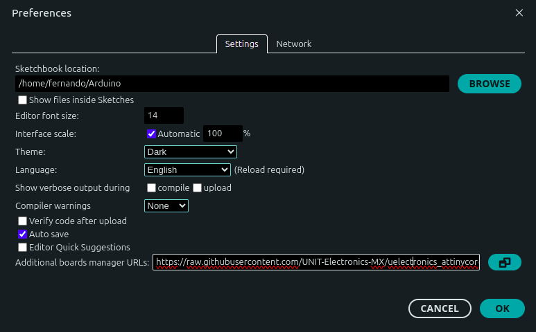
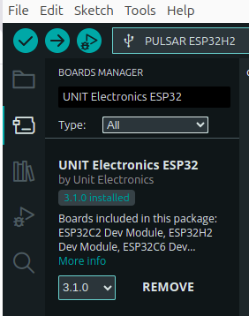
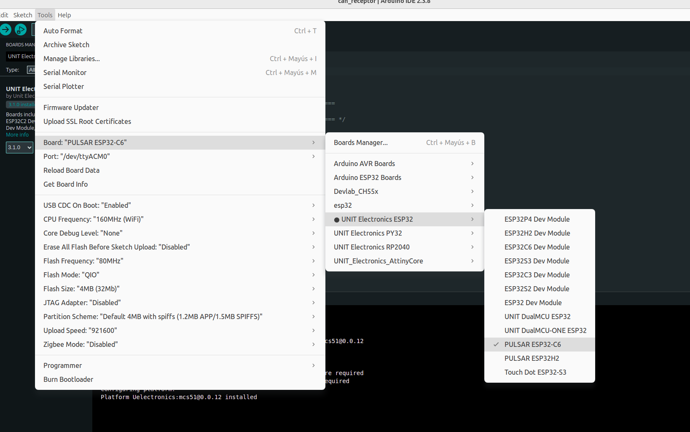

<script setup>
import { withBase } from 'vitepress'
</script>

# Configuración de Arduino IDE para PULSAR C6

Arduino IDE es un entorno independiente de MicroPython y el flujo de trabajo
recomendado para las prácticas y ejemplos de la placa PULSAR C6 (ESP32-C6).
Esta página explica cómo instalarlo, configurar la placa y cargar un programa.

## 1. Instalar Arduino IDE

Descarga e instala Arduino IDE 2.x desde el <a href="https://www.arduino.cc/en/software" target="_blank">sitio web oficial de Arduino</a>.

## 2. Agregar la URL del gestor de placas para PULSAR C6

Arduino permite instalar paquetes de plataformas de terceros mediante el
**Gestor de placas**. Para que Arduino IDE reconozca la PULSAR C6, primero debes
agregar el índice del paquete ESP32 de UNIT Electronics.

1.  Abre Arduino IDE y ve a **Archivo > Preferencias**.

<figure>



<figcaption>Referencia para localizar el campo de URLs adicionales</figcaption>

</figure>

2.  En el campo **Gestor de URLs Adicionales de Tarjetas**, pega exactamente la
    siguiente URL:

```text
https://raw.githubusercontent.com/UNIT-Electronics/Uelectronics-ESP32-Arduino-Package/main/package_Uelectronics_esp32_index.json
```

3.  Presiona **OK** para cerrar el cuadro de diálogo.

## 3. Instalar el paquete ESP32 desde el Gestor de placas

1.  Ve a **Herramientas > Placa > Gestor de placas**.
2.  Escribe `UNIT Electronics ESP32` en el buscador e instala el paquete
    **UNIT Electronics ESP32**.

<figure>

<figcaption>Referencia visual del Gestor de placas</figcaption>
</figure>


3.  Una vez instalado, ve a **Herramientas > Placa > UNIT Electronics ESP32**
    y selecciona **PULSAR ESP32-C6**.

<figure>

<figcaption>Referencia visual del Gestor de placas</figcaption>
</figure>

Verifica que el puerto serie correcto esté seleccionado en **Herramientas > Puerto** antes de compilar y cargar un sketch.


## 4. Compilar y cargar un programa

1.  Conecta la PULSAR C6 mediante un cable USB que permita transferencia de datos.
2.  Abre el sketch que deseas cargar.
3.  Confirma que estén seleccionados **PULSAR ESP32-C6** y el puerto serie de
    la placa.
4.  Presiona **Verificar** para compilar el programa.
5.  Presiona **Cargar** y espera el mensaje de finalización.

Si el puerto no aparece, prueba otro cable USB o puerto de la computadora y
vuelve a abrir Arduino IDE.

## Paquetes adicionales de UNIT Electronics

Los siguientes índices no son necesarios para programar la PULSAR C6, pero
puedes agregarlos para dejar Arduino IDE preparado para otras familias de
placas de UNIT Electronics.

| Familia | Repositorio |
|---|---|
| ESP32 | [Uelectronics-ESP32-Arduino-Package](https://github.com/UNIT-Electronics/Uelectronics-ESP32-Arduino-Package) |
| RP2040 | [Uelectronics-RP2040-Arduino-Package](https://github.com/UNIT-Electronics/Uelectronics-RP2040-Arduino-Package) |
| CH552 / MCS51 | [Uelectronics-CH552-Arduino-Package](https://github.com/UNIT-Electronics/Uelectronics-CH552-Arduino-Package) |
| PY32 | [unit_electronics_py32_arduino_package](https://github.com/UNIT-Electronics-MX/unit_electronics_py32_arduino_package) |
| ATtiny | [uelectronics_attinycore_arduino_package](https://github.com/UNIT-Electronics-MX/uelectronics_attinycore_arduino_package) |

### Copiar todos los índices

Arduino IDE acepta varias URLs separadas por comas. Copia la línea completa y
pégala en **Gestor de URLs Adicionales de Tarjetas** para registrar todos los
paquetes:

```text
https://raw.githubusercontent.com/UNIT-Electronics/Uelectronics-ESP32-Arduino-Package/main/package_Uelectronics_esp32_index.json,https://raw.githubusercontent.com/UNIT-Electronics/Uelectronics-RP2040-Arduino-Package/main/package_Uelectronics_rp2040_index.json,https://raw.githubusercontent.com/UNIT-Electronics/Uelectronics-CH552-Arduino-Package/refs/heads/main/package_duino_mcs51_index.json,https://raw.githubusercontent.com/UNIT-Electronics-MX/unit_electronics_py32_arduino_package/main/package_unit_electronics_py32_index.json,https://raw.githubusercontent.com/UNIT-Electronics-MX/uelectronics_attinycore_arduino_package/refs/heads/main/package_uelectronics_attiny_custom.json
```

Agregar los índices solo permite que los paquetes aparezcan en el Gestor de
placas; no instala automáticamente todos los paquetes. Instala únicamente los
que vayas a utilizar.

## Documentación adicional

Consulta la <a href="https://wiki.uelectronics.com/tutoriales/inicio-arduino" target="_blank">guía de instalación de paquetes de UNIT Electronics</a> para más detalle y capturas de pantalla por sistema operativo.
